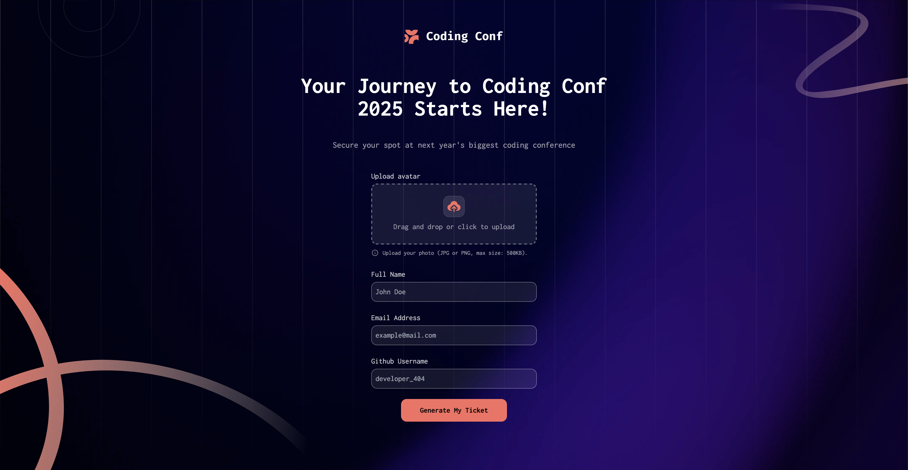

# Frontend Mentor - Conference ticket generator solution

This is a solution to the [Conference ticket generator challenge on Frontend Mentor](https://www.frontendmentor.io/challenges/conference-ticket-generator-oq5gFIU12w). Frontend Mentor challenges help you improve your coding skills by building realistic projects. 

## Table of contents

- [Overview](#overview)
  - [The challenge](#the-challenge)
  - [Screenshot](#screenshot)
  - [Built with](#built-with)

**Note: Delete this note and update the table of contents based on what sections you keep.**

## Overview

### The challenge

Users should be able to:

- Complete the form with their details
- Receive form validation messages if:
  - Any field is missed
  - The email address is not formatted correctly
  - The avatar upload is too big or the wrong image format
- Complete the form only using their keyboard
- Have inputs, form field hints, and error messages announced on their screen reader
- See the generated conference ticket when they successfully submit the form
- View the optimal layout for the interface depending on their device's screen size
- See hover and focus states for all interactive elements on the page

### Screenshot

### Links

- Solution URL: [Add solution URL here](https://github.com/svetstoykov/react-practice/tree/main/frontendmentor-ticket-generator)
- Live Site URL: [Add live site URL here](hhttps://steady-horse-c3c5c7.netlify.app)

### Built with

- [React](https://reactjs.org/)
- [TailwindCSS](https://tailwindcss.com) - Styling
- [AOS](https://michalsnik.github.io/aos/) - Animations
- [FramerMotion](https://motion.dev) - Animations
- Bundled with [vite](https://vite.dev/guide/)